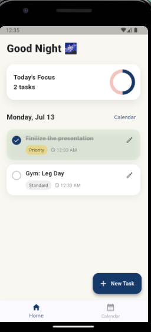
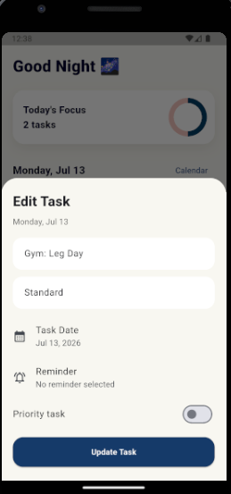
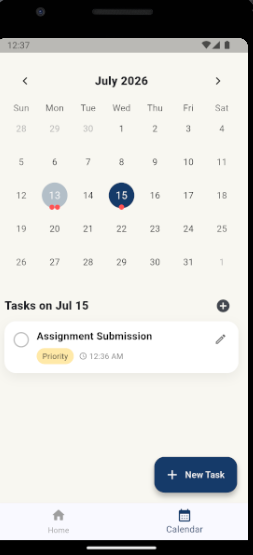

# Daily Task

Daily Task is a clean and modern Flutter to-do application designed to help users organize their daily tasks, manage upcoming tasks, set reminders, and track progress with a smooth animated user interface.

The app uses local storage, so tasks are saved directly on the device without requiring an internet connection.

---

## 📱 Features

- Add daily tasks
- Add tasks for upcoming dates
- Edit existing tasks
- Delete tasks with swipe action
- Mark tasks as completed
- Priority task support
- Priority tasks appear at the top
- Local database using Hive
- Task reminder notification
- Calendar view for date-based tasks
- Today-only task view on the home screen
- Animated task cards and bottom sheet
- Daily progress indicator
- Time-based greeting:
  - Good Morning
  - Good Afternoon
  - Good Evening
  - Good Night

---

## 🛠️ Built With

- Flutter
- Dart
- Hive
- Hive Flutter
- Flutter Animate
- Table Calendar
- Intl
- Flutter Local Notifications
- Timezone

---

## 📂 Project Structure

```bash
lib/
│
├── main.dart
│
├── models/
│   └── task_model.dart
│
├── screens/
│   └── home_screen.dart
│
└── services/
    ├── task_service.dart
    └── notification_service.dart

```
---

🧠 How It Works

The app stores all tasks locally using Hive. Each task contains:

Task title
Category
Task date
Created time
Reminder time
Priority status
Completion status

Tasks are filtered by date. The home screen only shows today’s tasks, while the calendar screen allows users to view and add tasks for future dates.

---

 ## 📸 Screenshots

 ---







---

✨ Main Functionalities

Add Task

Users can add a new task with title, category, date, reminder, and priority status.

Edit Task

Existing tasks can be edited from the task card edit button.

Complete Task

Users can tap the circle checkbox to mark a task as done.

Delete Task

Users can swipe a task card from right to left to delete it.

Reminder

Users can set a reminder time for any task. The app schedules a local notification for that task.

Calendar Tasks

Users can select any date from the calendar and add or view tasks for that date.

---

🎨 UI Highlights

- Soft modern background color
- Clean task cards
- Animated modal bottom sheet
- Smooth fade and slide animations
- Circular progress indicator
- Priority badges
- Reminder time indicator
- Responsive task title wrapping

---